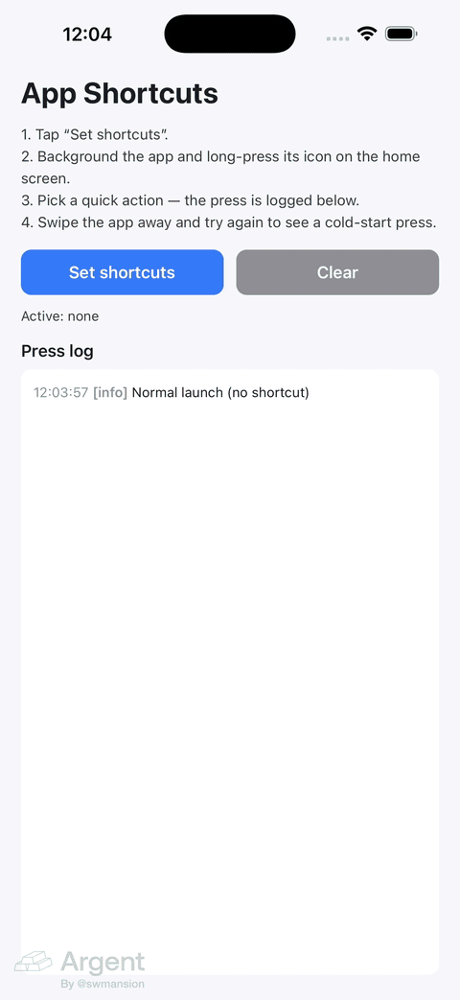

# react-native-app-shortcuts

[](https://github.com/giaBaoJS/react-native-app-shortcuts/actions/workflows/ci.yml)
[](./LICENSE)
[](https://reactnative.dev/architecture/landing-page)
[](https://www.npmjs.com/package/react-native-app-shortcuts)

<p align="center"></p>

Home-screen **quick actions** (long-press the app icon) for React Native, built for the **New Architecture**: dynamic shortcuts on iOS (`UIApplicationShortcutItem`) and Android (`ShortcutManager`).

## Why

The popular legacy library (`react-native-quick-actions`) is unmaintained and not compatible with the New Architecture. `react-native-app-shortcuts` is the modern replacement:

- TurboModule spec, works with React Native's New Architecture (bridgeless).
- One typed API for both platforms, with an arbitrary string payload per shortcut.
- Correct cold-start handling (`getInitialShortcut`) and warm-press events, with native buffering so presses that arrive before JS is ready are never lost.
- A `useShortcutPress` hook that fires for **both** cold-start and warm presses, de-duplicated.

## Platform matrix

| Platform | Minimum | Notes |
| --- | --- | --- |
| iOS | 13+ (effectively your RN minimum) | SF Symbol icons via `UIApplicationShortcutIcon` |
| Android | API 25+ (Android 7.1) | Below API 25 all calls are safe no-ops (`setShortcuts` resolves, `getShortcuts` returns `[]`) |

## Installation

```sh
npm install @giabaojs/react-native-app-shortcuts
# or
yarn add @giabaojs/react-native-app-shortcuts
```

Then install pods:

```sh
cd ios && pod install
```

## Required native setup

### iOS — wire your AppDelegate (required)

A library cannot intercept quick action presses by itself: iOS delivers them to **your** AppDelegate. Add the forwarding calls below (the example app in [`example/ios`](example/ios/AppShortcutsExample/AppDelegate.swift) is the reference integration).

<details open>
<summary><b>Swift</b> (default RN template)</summary>

```swift
import AppShortcuts

@main
class AppDelegate: UIResponder, UIApplicationDelegate {
  func application(
    _ application: UIApplication,
    didFinishLaunchingWithOptions launchOptions: [UIApplication.LaunchOptionsKey: Any]? = nil
  ) -> Bool {
    // Record a possible cold-start quick action.
    AppShortcuts.setInitialShortcut(launchOptions: launchOptions)

    // ... existing React Native setup ...
    return true
  }

  // Called for warm presses AND for cold starts (because
  // didFinishLaunchingWithOptions returns true above).
  func application(
    _ application: UIApplication,
    performActionFor shortcutItem: UIApplicationShortcutItem,
    completionHandler: @escaping (Bool) -> Void
  ) {
    completionHandler(AppShortcuts.handleShortcutItem(shortcutItem))
  }
}
```

</details>

<details>
<summary><b>Objective-C</b></summary>

```objc
#import <AppShortcuts/AppShortcuts.h>

- (BOOL)application:(UIApplication *)application
    didFinishLaunchingWithOptions:(NSDictionary *)launchOptions
{
  // Record a possible cold-start quick action.
  [AppShortcuts setInitialShortcutFromLaunchOptions:launchOptions];

  // ... existing React Native setup ...
  return YES;
}

// Called for warm presses AND for cold starts (because
// didFinishLaunchingWithOptions returns YES above).
- (void)application:(UIApplication *)application
    performActionForShortcutItem:(UIApplicationShortcutItem *)shortcutItem
               completionHandler:(void (^)(BOOL))completionHandler
{
  completionHandler([AppShortcuts handleShortcutItem:shortcutItem]);
}
```

</details>

See [docs/ios-setup.md](docs/ios-setup.md) for the exact cold-start contract.

### Android — usually zero-config

Nothing to add for most apps. Two requirements that the default React Native template already satisfies:

1. `MainActivity` must use `android:launchMode="singleTask"` in `AndroidManifest.xml` (the RN template default) so warm presses arrive via `onNewIntent` instead of relaunching the activity.
2. Autolinking must be active (it is, by default).

See [docs/android-behavior.md](docs/android-behavior.md) for intent details and API-level behavior.

## Quick start

```tsx
import {
  setShortcuts,
  useShortcutPress,
  type ShortcutItem,
} from '@giabaojs/react-native-app-shortcuts';

// Register shortcuts (replaces any previously set):
await setShortcuts([
  {
    id: 'compose',
    title: 'New Message',
    subtitle: 'Start a conversation', // iOS subtitle / Android longLabel
    iconName: Platform.OS === 'ios' ? 'square.and.pencil' : 'ic_compose',
    data: { screen: 'compose' },
  },
]);

// Handle presses (cold start + warm, de-duplicated):
function App() {
  useShortcutPress((item: ShortcutItem) => {
    navigate(item.data?.screen);
  });
  // ...
}
```

## API reference

All functions are exported both as named exports and on the default export. Full details in [docs/API.md](docs/API.md).

| API | Signature | Description |
| --- | --- | --- |
| `setShortcuts` | `(shortcuts: ShortcutItem[]) => Promise<void>` | Replaces all dynamic shortcuts. Rejects on duplicate ids or empty `id`/`title`. |
| `clearShortcuts` | `() => Promise<void>` | Removes all dynamic shortcuts. |
| `getShortcuts` | `() => Promise<ShortcutItem[]>` | Returns the currently registered dynamic shortcuts. |
| `getInitialShortcut` | `() => Promise<ShortcutItem \| null>` | The shortcut that cold-started the app, else `null`. Stable per process launch. |
| `addShortcutListener` | `(cb: (item: ShortcutItem) => void) => EventSubscription` | Warm presses while the app is alive/backgrounded. Presses before JS is ready are buffered and flushed. |
| `useShortcutPress` | `(cb: (item: ShortcutItem) => void) => void` | Hook: fires for both the initial shortcut and warm presses, de-duplicated. **Recommended.** |

```ts
type ShortcutItem = {
  id: string; // unique, returned on press
  title: string;
  subtitle?: string; // iOS subtitle (used as longLabel on Android)
  iconName?: string; // iOS: SF Symbol name; Android: drawable resource name
  data?: { [key: string]: string }; // payload returned on press
};
```

## Icons

- **iOS**: `iconName` is an [SF Symbol](https://developer.apple.com/sf-symbols/) name, e.g. `"star.fill"`, `"magnifyingglass"`, `"square.and.pencil"`. Rendered via `UIApplicationShortcutIcon iconWithSystemImageName:`.
- **Android**: `iconName` is the name of a **drawable resource in your app** (looked up in `drawable`, then `mipmap`), e.g. an `ic_compose.xml` vector in `android/app/src/main/res/drawable/`. If the resource cannot be found the shortcut is created without an icon (no crash).

## Limits

- iOS shows at most 4 dynamic quick actions; Android launchers typically show 4–5 (`ShortcutManager` rejects more than `getMaxShortcutCountPerActivity`, which surfaces as a rejected promise).
- `data` values must be strings (serialize anything richer yourself).

## Troubleshooting

| Symptom | Fix |
| --- | --- |
| Shortcut press never reaches JS on iOS | Your AppDelegate is not wired — add the `performActionForShortcutItem` forwarding shown above. This is by far the most common issue. |
| `getInitialShortcut()` resolves `null` on iOS cold start | Either wire `setInitialShortcut(launchOptions:)`, or make sure `didFinishLaunchingWithOptions` returns `true` so iOS calls `performActionForShortcutItem` for cold starts (either path is sufficient). |
| Same press delivered twice after rotation on Android | Should not happen — the library marks intents consumed. If you also read the intent yourself, don't re-dispatch it. |
| Warm press restarts the Android app | Your `MainActivity` is missing `android:launchMode="singleTask"`. |
| No icon on Android | The drawable name doesn't exist in the host app. Check `android/app/src/main/res/drawable*/`. |
| `setShortcuts` resolves but nothing appears (Android) | Device runs API < 25 — dynamic shortcuts are unsupported and the call is a documented no-op. |

## Example app

The [`example`](example) app is the reference integration: it sets 3 sample shortcuts (SF Symbols on iOS, bundled vector drawables on Android), clears them, and shows a live log of presses (cold/warm + payload).

```sh
yarn
yarn example ios     # or: yarn example android
```

## Contributing

See the [contributing guide](CONTRIBUTING.md) to learn how to contribute to the repository and the development workflow.

## License

MIT © [Bao Nguyen](https://github.com/giaBaoJS)
